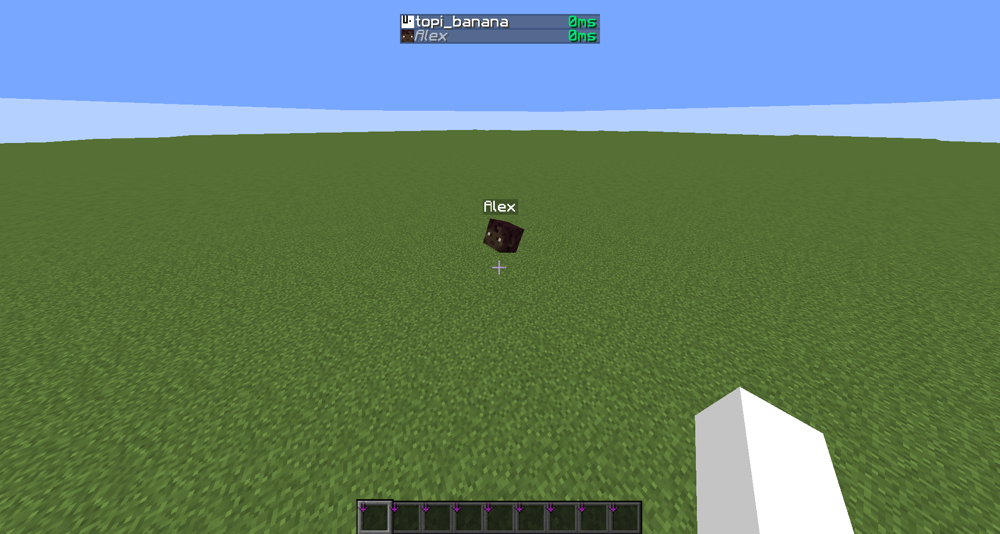
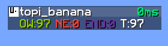

## ルール

### commandCustomLoad

`/custom-load`コマンドの有効化。AMS の blockChunkLoader から発想を得ました。

- 型式: `String`
- 既定値: `ops`
- 使用可能な値: `true`, `false`, `ops`, `0`, `1`, `2`, `3`, `4`
- 分類: `SURVIVAL`, `COMMAND`, `VULPEUS`

### commandHat

`/hat`コマンドの有効化。essential addons からの移植。

- 型式: `String`
- 既定値: `ops`
- 使用可能な値: `true`, `false`, `ops`, `0`, `1`, `2`, `3`, `4`
- 分類: `SURVIVAL`, `COMMAND`, `VULPEUS`

### commandSit

`/sit`コマンドの有効化。PCA からの移植。

- 型式: `String`
- 既定値: `ops`
- 使用可能な値: `true`, `false`, `ops`, `0`, `1`, `2`, `3`, `4`
- 分類: `SURVIVAL`, `COMMAND`, `VULPEUS`

### commandView

`/view`コマンドの有効化。
carpet の viewDistance を変更することができる。

- 型式: `String`
- 既定値: `ops`
- 使用可能な値: `true`, `false`, `ops`, `0`, `1`, `2`, `3`, `4`
- 分類: `SURVIVAL`, `COMMAND`, `VULPEUS`

### defaultOpLevel

サーバーに参加したときにデフォルトでOPを付与する。
server.properties の`op-permission-level`を上書き可能。

- 型式: `int`
- 既定値: `0`
- 分類: `CREATIVE`,`VULPEUS`

### disableCCECrash

ClassCastException によるサーバーのクラッシュの無効化。

> [!WARNING]
> 他と比べてより速いが、より危険。

- 型式: `boolean`
- 既定値: `false`
- 分類: `VULPEUS`

### disableIAECrash

IllegalArgumentException によるサーバーのクラッシュの無効化。

> [!WARNING]
> 他と比べてより速いが、より危険。

- 型式: `boolean`
- 既定値: `false`
- 分類: `VULPEUS`

### disableSOECrash

> [!WARNING]
> 他と比べてより速いが、より危険。

StackOverflowError によるサーバーのクラッシュの無効化。

- 型式: `boolean`
- 既定値: `false`
- 分類: `VULPEUS`

### fixedBeeNotLeavingHive (<=1.21.1)

[MC-168329](https://bugs.mojang.com/browse/MC-168329) の修正。

> [!NOTE]
> carpet-fixesと併用した場合、機能しなくなります。<br>
> carpet-fixesの`beeNotLeavingHiveFix`を使用してください。

- 型式: `boolean`
- 既定値: `false`
- 分類: `BUGFIX`, `VULPEUS`

### fixedFallingBlockCantUseNetherPortal (<=1.20.6)

[MC-9644](https://bugs.mojang.com/browse/MC-9644) の修正。

- 型式: `boolean`
- 既定値: `false`
- 分類: `BUGFIX`, `VULPEUS`

### fixedTickMemoriesEntityAI (<=1.20.1)

[MC-254100](https://bugs.mojang.com/browse/MC-254100) の修正

- 型式: `boolean`
- 既定値: `false`
- 分類: `BUGFIX`, `VULPEUS`

### optmizedDragonRespawn

エンダードラゴンのリスポーン処理の最適化。carpet AMS addition からの移植。
> [!WARNING]
> このルールはバニラと同一の挙動を保証しません。

- 型式: `boolean`
- 既定値: `false`
- 分類: `OPTIMIZATION`, `VULPEUS`

### visibleSpectators

スペクテーターのプレイヤーをスペクテーターではないプレイヤーから見えるようにする。totots carpet tweaks からの移植。



- 型式: `boolean`
- 既定値: `false`
- 分類: `SURVIVAL`, `VULPEUS`

## コマンド

### custom-load

`/custom-load` : 現在の CustomLoadingChunk のリストを表示。

`/custom-load add [<dimension>] [<cx>] [<cz>] [<radius>]` : リストに追加

`/custom-load remove [<dimension>] [<index>]` : リストから削除

`[<dimension>]` : ディメンションID

`[<cx>]` : ロード範囲の中心チャンクの ChunkX

`[<cz>]` : ロード範囲の中心チャンクの ChunkZ

`[<radius>]` : 半径

`[<index>]` : 要素のインデックス。`/custom-load`で確認できます。

### hat

`/hat` : 頭に所持しているアイテムを装備します。不死のトーテムや空でないシュルカーボックスは装備できません。また、束縛の呪いが付いた装備すでにしている場合も同様です。

### sit

`/sit` : 座ります。

### view

`/view` : 現在の描画距離設定を表示します。

`/view [<distance>]` : carpet での viewDistance を変更します。

`[<distance>]` : 0 から 32 でなければなりません

### playerActions

> [!NOTE]
> fakePlayer でのみ利用可能。

`/player [<name>] fill [<state>]` : コンテナを開いたときにインベントリの中身をすべて入れる。

`/player [<name>] clean [<state>]` : コンテナを開いたときにコンテナの中身をすべて捨てる。

`[<name>]` : fake player の名前

`[<state>]` : `true` か `false`

## ロガー

### autosave

`/log autosave`

オートセーブされてからの時間と、次のオートセーブまでの時間をプレイヤーリストに表示。
このロガーはサーバー開始からのチックから算出されるため、正確ではない場合があることに留意してください。
essential addons からの移植。

### entity_count



`/log entity_count`

`/log entity_count [<entities>]`

ディメンション毎と合計のエンティティの数をプレイヤーリストに表示。

`[<entities>]` : エンティティID。カンマ区切りで複数入力することも可能。`minecraft:`の接頭語は省略可。

※ `:`を含める場合は引数全体をダブルクォーテーションで囲う必要があります。
```
/log entity_count player
/log entity_count "minecraft:player,minecraft:iron_golem"
```
